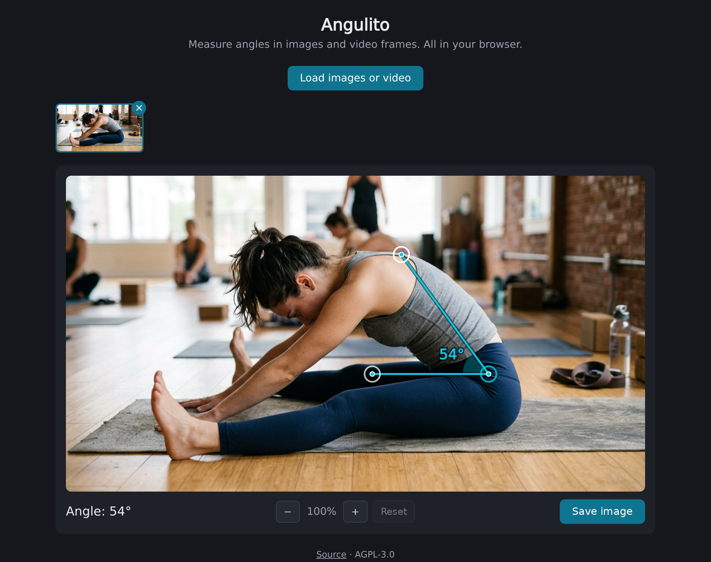

# Angulito

Measure angles in images and video frames, entirely in the browser. Load a photo or video, place three points to form an angle, read off the value, and save the annotated image.

All processing happens client side. The app is a static WASM bundle that runs in any browser with WebAssembly support, and no media ever leaves it.

**[Try it.](https://treiher.github.io/angulito/)**

[](https://treiher.github.io/angulito/)

## Features

- Load any number of images plus one video, in any format the browser can decode. Each image and each captured video frame becomes a frame of its own in the thumbnail strip, and frames can be deleted individually.
- For videos: scrub to any position, step by single frames or seconds, and capture as many frames as needed.
- Drag three points (two ends and a vertex) on the selected frame. The angle between the two lines is displayed live in degrees from 0 to 180, with a magnifier loupe for precise placement.
- Zoom the frame with the mouse wheel, a two-finger pinch or the zoom buttons, and pan it by dragging the frame with the mouse or one finger.
- Keyboard access: focus a handle with Tab and nudge it with the arrow keys (hold Shift for larger steps).
- Save the frame with the angle overlay baked in as a PNG. The export always uses the full resolution of the source image, whatever the current zoom is.

## Development

The only prerequisite is Nix with flakes enabled. The dev shell provides the whole toolchain: Rust with the wasm target and the Dioxus tooling for the app itself, plus the Python linters and Playwright with a Chromium build for the checks and the end-to-end tests.

Enter the shell with `nix develop`, or run `direnv allow` once to have it loaded automatically by the checked-in `.envrc`. Inside the shell:

```sh
dx serve          # development server with hot reload (under /angulito/)
make build        # release bundle in target/dx/angulito/release/web/public
make check        # formatting, clippy, ruff, ty
make test         # unit tests + end-to-end tests
make all          # check + test
make format       # apply formatting and lint fixes
make screenshot   # regenerate docs/screenshot.jpg
make clean        # remove build output and tool caches
```

Single commands can be run without entering the shell, which is how the checks on every pull request invoke them (`.github/workflows/verify.yml`):

```sh
nix develop -c make all
```

The bundle produced by `make build` can be served by any static file server.

The flake provides a shell on Linux and macOS, but only `x86_64-linux` is covered by CI. The end-to-end tests have only been run on Linux.

Dependency updates are opened daily by Renovate and auto-merged once the checks pass (`.github/renovate.json5`). One thing is outside that and is bumped by hand: the `dioxus` and `wasm-bindgen` versions in `Cargo.toml`. They are exact pins that must match the CLI versions shipped by nixpkgs, so they move together with `flake.lock`.

Auto-merge relies on two branch protection settings on `main` that cannot be configured from the repository files: the `test` job has to be a required status check, and "Require branches to be up to date before merging" has to be enabled. Renovate rebases a pull request that fell behind `main` once it is otherwise ready to merge, so the up-to-date rule does not leave it stuck.

## Deployment

Every push to `main` runs the checks and tests and then deploys to GitHub Pages (`.github/workflows/deploy.yml`), publishing the same bundle the end-to-end tests ran against.

The deployment relies on one setting that cannot be configured from the repository files: the Pages source has to be set to GitHub Actions in the repository settings, or the deploy job fails.

The app is served under `https://treiher.github.io/angulito/`, which is why `base_path` is set to `angulito` in `Dioxus.toml`, and why `dx serve` also serves under `/angulito/` locally.

## License

Copyright (C) 2026 Tobias Reiher

Angulito is licensed under the [GNU Affero General Public License v3.0](LICENSE).

The [demo image](tests/e2e/fixtures/pancake.jpg) shown in the screenshot above was AI-generated and does not depict a real person.
